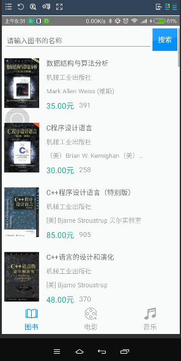

# rn-douban-search

学习《React Native入门与实战》豆瓣搜索的案例，移植到Android并用ES2015重写，增加详细的注释

### [Android版下载](http://workhard.top/dousou.apk)

## 截图：


## 安装及运行：
##### 1. 下载
```bash
$ git clone git@github.com:uniquexiaobai/rn-douban-search.git
```
##### 2. 安装依赖
```bash
$ cd rn-douban-search && npm install
```
##### 3. 运行
- Android版运行：
```bash
$ react-native start
$ react-native run-android
```
- IOS版运行：<br/>
双击 `~/ios/doubanSearch.xcodeproj` 文件，默认用 `Xcode` 打开，点击运行即可
